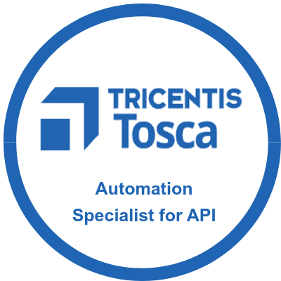
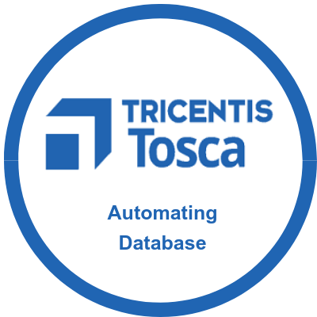
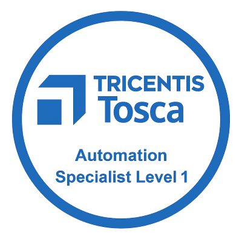

# TEST LEAD 

#### Technical Skills: Selenium, Java, POM, BDD, Cucumber, ETL, SQL, Postman, Jira, HP ALM

## EDUCATION								       		
- MS, Software Engineering | BITS Pilani University  (2012 — 2015)	 			        		
- BSC, Computer Science | Sri Venkateswara University, Tirupati (2008 — 2011)

## PROFILE
With 13+ years of experience in software testing, including 4+ years of onsite experience in the UK, I specialize in automation testing using tools like Selenium, Java, BDD with Cucumber, ETL testing using Informatica Powercenter, Database testing using Teradata, Oracle and DBeaver, API testing using Postman. I have a proven track record of developing end-to-end testing solutions and improving operational efficiency.

## EMPLOYMENT HISTORY
### Test Lead at Wipro, BANGALORE, INDIA   - September 2011 — Present
- As a Test Lead successfully delivered testing projects across Web, Desktop, Backend database and API platforms.
- Collaborated closely with Project Management, Product Owners and Stakeholders to ensure effective test coordination and timely delivery.
- Prepared and maintained QA governance artifacts such as Master Test Plan(MTP), Requirement Traceability Matrix (RTM) and End of Test Report(EOTR).
- Prepared detailed test scenarios and test cases, worked on test case execution and provided detailed defect and status reporting.
- Performed Regression Testing, System Testing, System Integration Testing(SIT) and Automation script management.
- Supported UAT test execution for Business users, ensuring smooth sign-off.
- Reviewed team's deliverables including test cases and execution results, tracked progress and reported status updates to Client Managers.

### AUTOMATION
- Developed and executed automated test scripts using Selenium WebDriver and Java.
- Created and maintained Feature Files in BDD format using Gherkin language, and developed Step Definition files integrating with Cucumber for BDD testing. 
- Hands on experience in preparing Automated Tests, Test Data and executing the same.
- Actively contributed to implementing BDD practices, improving collaboration between QA, Developers, and Business Analysts.
- Hands-on experience in API Testing using Postman, validating request/response payloads, status codes.
- Training knowledge on Python language, CI/CD pipeline, Jenkins, TestNG.

## CERTIFICATIONS
- Microsoft certified Azure Fundamentals
- FreeCodeCamp Certified Scientific Computing with Python
- Udemy certified The Complete Java Certification Course
- Tricentis Tosca Automation Specialist for API
- Tricentis Tosca Automation Specialist for databases
- Tricentis Tosca Automation Specialist level 1 and level 2
- Tricentis Tosca Exploratory testing Specialist
- Tricentis Tosca Test design specialist level 1 and level 2
- Wipro Internal Certifications

## AWARDS AND RECOGNITIONS
- Habit Flagbearer – Always Communicating
- Habit Flagbearer – Building Trust
- Outstanding performance and Continuos Excellence
- Feather in My Cap
- Pleasure to work with you
- You are a Star

## PROJECTS
- Automated Trade Reporting project: Reduced regression execution time by 70% using Java and BDD with Cucumber.
- Automated Portal Web Application project: Reduced regression execution time by 80% using Selenium Java and BDD with Cucumber.
- Led and delivered cybersecurity testing projects for banking domain, ensuring compliance and data protection.
- Delivered complex ETL projects by validating data pipelines built on Informatica PowerCenter, and performed in-depth database testing using advanced SQL queries on Teradata and Oracle.

### BADGE

<!--  -->